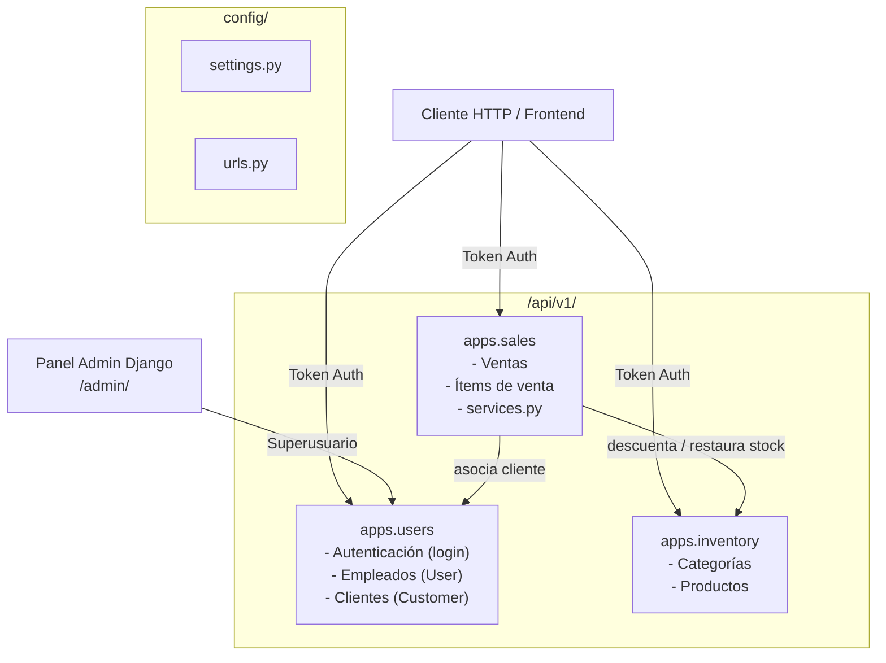

# Retail Store API — Visión General

## ¿Qué es este proyecto?

**Retail Store API** es una API REST construida con Django y Django REST Framework, pensada para gestionar las operaciones básicas de una tienda minorista local. Permite registrar ventas, administrar el inventario de productos y categorías, y gestionar clientes y empleados.

## Contexto y diseño intencional

El sistema está diseñado para ser **simple y directo**:

- Los **empleados** son creados exclusivamente por el superusuario desde el panel administrativo de Django. No existe registro público de cuentas.
- Los empleados hacen **login** para obtener un token y luego pueden registrar ventas.
- Los **clientes** son opcionales en una venta; pueden registrarse o comprar de forma anónima.
- El stock se descuenta automáticamente al crear una venta y se restaura si la venta se cancela.

## Stack tecnológico

| Componente | Tecnología |
|---|---|
| Framework | Django 6.0.1 |
| API | Django REST Framework 3.15.2 |
| Autenticación | Token Authentication (DRF built-in) |
| CORS | django-cors-headers 4.9.0 |
| Base de datos (dev) | SQLite |
| Base de datos (prod) | PostgreSQL (psycopg2-binary) |
| Variables de entorno | python-dotenv 1.2.1 |
| Testing | pytest 8.3.2 + pytest-django + pytest-cov |
| Servidor producción | Gunicorn 23.0.0 |

## Arquitectura de aplicaciones



## Estructura de archivos

```
retail-store-api/
├── config/              # Configuración del proyecto Django
│   ├── settings.py
│   ├── urls.py
│   ├── wsgi.py
│   └── asgi.py
├── apps/
│   ├── inventory/       # Categorías y productos
│   ├── users/           # Clientes, empleados y autenticación
│   └── sales/           # Ventas, ítems y lógica de negocio
├── docs/                # Documentación del proyecto
├── .env.example         # Plantilla de variables de entorno
├── manage.py
├── pytest.ini
└── requirements.txt
```

## Prefijo base de la API

```
/api/v1/
```
