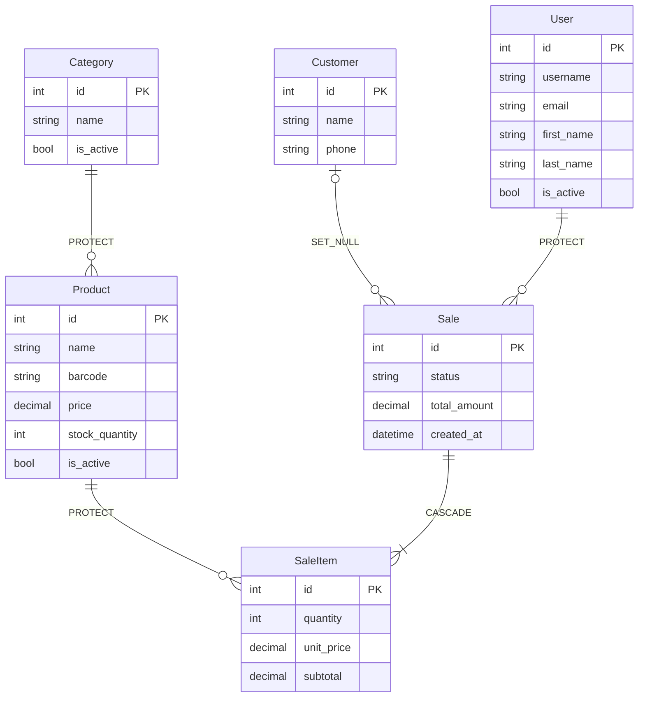

# Modelo de Dominio

## Diagrama entidad-relación

---

## Descripción de modelos

### `Category` — `apps/inventory`

Representa una categoría de productos.

| Campo | Tipo | Restricciones |
|---|---|---|
| `id` | AutoField | PK, auto |
| `name` | CharField(70) | Único, mínimo 2 caracteres |
| `is_active` | BooleanField | Default: `True` |

**Comportamiento:** `save()` llama a `full_clean()` antes de persistir.

**Regla de negocio:** Solo se pueden asignar categorías **activas** a un producto. La validación ocurre en `ProductSerializer.validate_category()`.

---

### `Product` — `apps/inventory`

Representa un artículo del inventario.

| Campo | Tipo | Restricciones |
|---|---|---|
| `id` | AutoField | PK, auto |
| `name` | CharField(70) | Mínimo 2 caracteres |
| `barcode` | CharField(70) | Único |
| `category` | FK → Category | `on_delete=PROTECT` |
| `price` | DecimalField(8,2) | ≥ 0.00 |
| `stock_quantity` | PositiveSmallIntegerField | ≥ 0 |
| `is_active` | BooleanField | Default: `True` |

**Comportamiento:** `save()` llama a `full_clean()` antes de persistir.

**Regla de negocio:** Solo se pueden vender productos **activos**. La validación ocurre en `SaleItemSerializer.validate_product()`.

---

### `Customer` — `apps/users`

Representa un cliente de la tienda. Su presencia en una venta es opcional.

| Campo | Tipo | Restricciones |
|---|---|---|
| `id` | AutoField | PK, auto |
| `name` | CharField(70) | Opcional — default: `'ANONIMO'` |
| `phone` | CharField(20) | Opcional — default: `'000000000'` |

**Comportamiento:** `save()` aplica `strip()` a nombre y teléfono. Si quedan vacíos tras el strip, se asignan los valores por defecto automáticamente.

---

### `User` — Django built-in

Los empleados de la tienda usan el modelo `User` nativo de Django. Son creados **exclusivamente por el superusuario** desde el panel administrativo. No existe registro público.

---

### `Sale` — `apps/sales`

Cabecera de una venta.

| Campo | Tipo | Restricciones |
|---|---|---|
| `id` | AutoField | PK, auto |
| `status` | CharField | Choices: `PAID` / `CANCELLED` |
| `total_amount` | DecimalField(10,2) | Default: 0, ≥ 0 |
| `customer` | FK → Customer | `on_delete=SET_NULL`, nullable |
| `created_by` | FK → User | `on_delete=PROTECT` |
| `created_at` | DateTimeField | `auto_now_add=True` |

**Comportamiento:** `save()` llama a `full_clean()` antes de persistir.

---

### `SaleItem` — `apps/sales`

Línea de detalle de una venta.

| Campo | Tipo | Restricciones |
|---|---|---|
| `id` | AutoField | PK, auto |
| `sale` | FK → Sale | `on_delete=CASCADE`, `related_name='items'` |
| `product` | FK → Product | `on_delete=PROTECT` |
| `quantity` | PositiveSmallIntegerField | > 0 |
| `unit_price` | DecimalField(10,2) | > 0 — capturado del producto al momento de la venta |
| `subtotal` | DecimalField(10,2) | Calculado: `quantity × unit_price` |

**Comportamiento:** `save()` calcula `subtotal = quantity × unit_price` y luego llama a `full_clean()`.

> El `unit_price` se congela en el momento de la venta. Cambios posteriores en el precio del producto no afectan ventas ya registradas.
