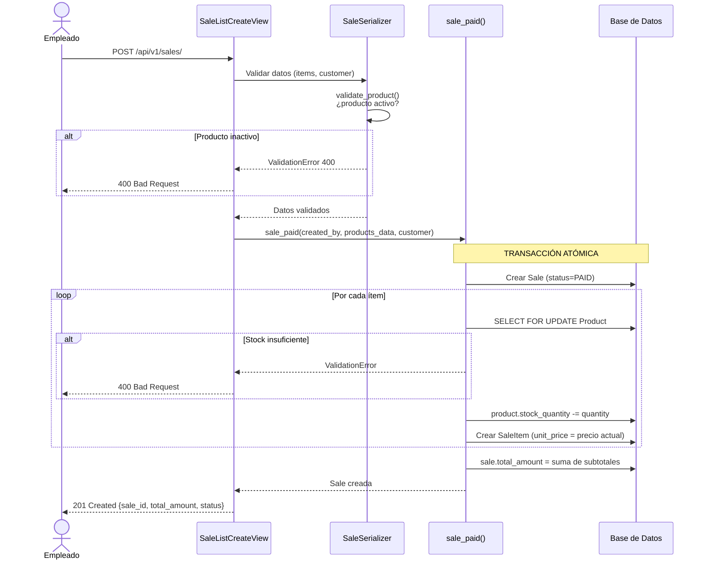
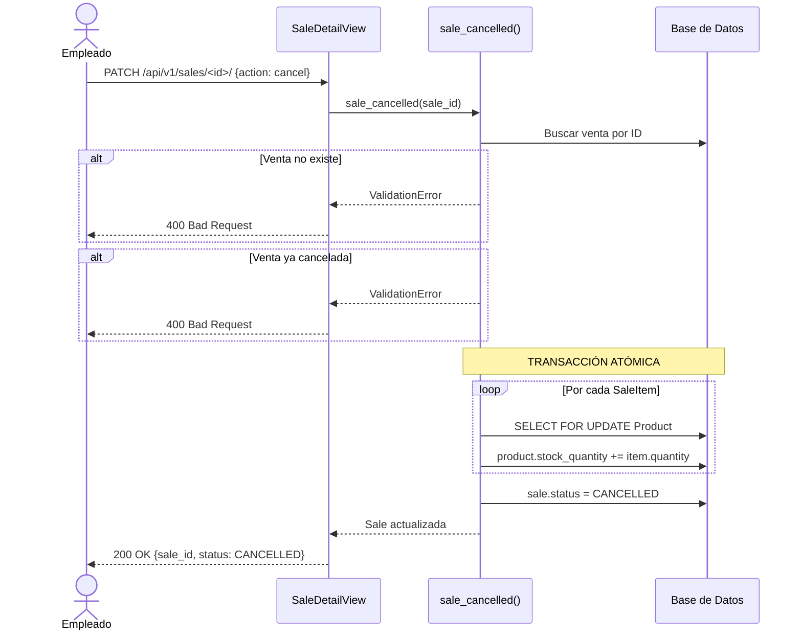
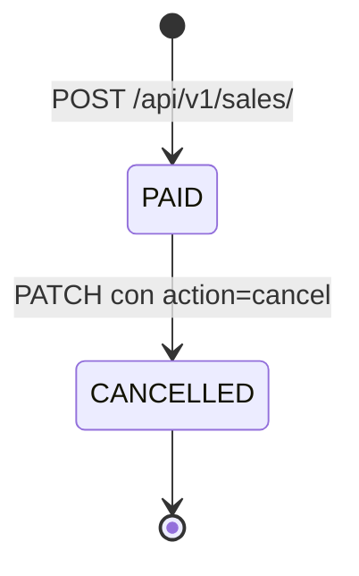

# Flujo de Ventas

## Descripción general

El módulo de ventas es el núcleo del sistema. Toda la lógica de negocio está encapsulada en `apps/sales/services.py` y se ejecuta dentro de **transacciones atómicas** para garantizar consistencia de datos.

---

## Crear una venta (`sale_paid`)

---

## Cancelar una venta (`sale_cancelled`)

---

## Estados de una venta

Una venta cancelada **no puede reactivarse**. El sistema no contempla ese flujo.

---

## Integridad transaccional

Ambas operaciones usan `transaction.atomic()` y `select_for_update()` sobre los productos para prevenir condiciones de carrera cuando varios empleados operan simultáneamente.

Si cualquier paso falla (producto inexistente, stock insuficiente, error de validación), **todos los cambios se revierten automáticamente** y la base de datos queda en el estado previo a la operación.
